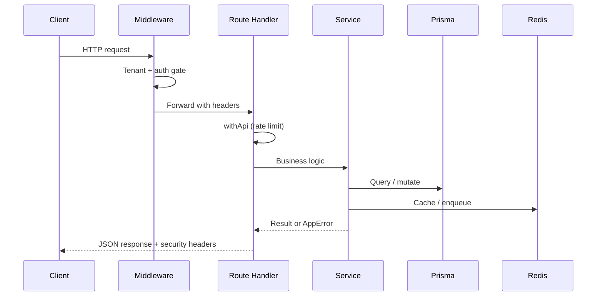

# Architecture

Enterprise architecture for **Shree Shyam Dairy Farm** — a production-grade, multi-tenant dairy ERP combining e-commerce, farm IoT/AI, mobile PWA, developer APIs, and enterprise security on a unified Next.js platform.

**Live:** [shree-shyam-dairy-farm.vercel.app](https://shree-shyam-dairy-farm.vercel.app)

---

## Executive summary

| Layer         | Technology                                                  |
| ------------- | ----------------------------------------------------------- |
| Runtime       | Node.js ≥ 20                                                |
| Framework     | Next.js 16 (App Router), React 19                           |
| Language      | TypeScript + legacy JavaScript (migration in progress)      |
| Styling       | Tailwind CSS v4                                             |
| Database      | PostgreSQL via Prisma 6                                     |
| Cache / queue | Redis, BullMQ                                               |
| Auth          | Custom JWT (`jose`), cookies, RBAC/ABAC, API keys, WebAuthn |
| Payments      | Razorpay, Stripe (tenant billing)                           |
| Storage       | Local / S3 / Cloudflare R2                                  |
| Logging       | Pino (structured, domain loggers)                           |
| Testing       | Vitest                                                      |

---

## System context

```
                         Internet
                             │
                    CDN / Edge (Vercel / Cloudflare)
                             │
              ┌──────────────┴──────────────┐
              │     Next.js Application      │
              │  (SSR, RSC, API Routes, PWA) │
              └──────────────┬──────────────┘
                             │
        ┌────────────────────┼────────────────────┐
        │                    │                    │
   PostgreSQL              Redis              Object Storage
   (Prisma ORM)         (cache, sessions,      (S3 / R2 / local)
                         BullMQ queues)
        │                    │
        └────────┬───────────┘
                 │
    ┌────────────┴────────────┐
    │  Background workers      │
    │  queue · mqtt · webhooks │
    └────────────┬────────────┘
                 │
         MQTT broker · OpenAI · Razorpay · Resend · MSG91
```

---

## Application layers

### 1. Presentation (`src/app`, `src/components`, `src/features`)

- **Marketing storefront** — product catalog, cart, checkout, subscriptions
- **Account portal** — orders, profile, GDPR tools
- **Admin dashboards** — farm, CRM, fleet, retail, processing, SaaS, security
- **Mobile PWA** (`/m`) — delivery, owner, customer roles
- **Developer portal** (`/developers`) — API keys, webhooks, docs

UI state uses React Context (cart, tenant), Zustand (cart store), and TanStack Query for server state.

### 2. API surface (`src/app/api`)

| Surface              | Prefix                        | Auth                |
| -------------------- | ----------------------------- | ------------------- |
| Internal REST        | `/api/v1/*`                   | JWT cookie / Bearer |
| Public developer API | `/api/public/v1/*`            | API key + scopes    |
| Legacy storefront    | `/api/payment/*`, `/api/chat` | Mixed               |
| Health / metrics     | `/api/health`                 | Public / token      |

Route handlers are wrapped with `withApi` (`src/lib/ops/api-handler.ts`) for rate limiting, metrics, security headers, and centralized error handling.

### 3. Domain services (`src/services`)

Business logic orchestration — one service module per domain (CRM, fleet, farm, tenant, mobile, SaaS, etc.). Services call repositories and modules; they should not import React.

### 4. Domain modules (`src/modules`)

Non-service domain code: notification channels, integration providers, document folders, workflow engines, etc.

### 5. Infrastructure (`src/lib`)

| Area        | Path            | Responsibility                                        |
| ----------- | --------------- | ----------------------------------------------------- |
| Security    | `lib/security/` | Auth, permissions, ABAC, audit, encryption, OTP       |
| API helpers | `lib/api/`      | Public API auth, scopes, versioning                   |
| Ops         | `lib/ops/`      | Rate limit, metrics, storage, queue, security headers |
| Logging     | `lib/logging/`  | Pino loggers (API, DB, payment, audit, …)             |
| Errors      | `lib/errors/`   | AppError hierarchy, API error handler                 |
| Tenant      | `lib/tenant/`   | Resolve tenant from host, i18n, branding              |

### 6. Configuration (`src/config`)

Validated environment configuration composed from domain slices (`app`, `auth`, `database`, `payment`, `ai`, `email`, `storage`, `logging`). Validated at startup via `instrumentation.ts` and `npm run env:validate`.

### 7. Data access (`src/repositories`)

Prisma client singleton (`repositories/prisma.ts`) with `isDatabaseConfigured()` guard for build-time and optional DB environments.

### 8. Edge middleware (`src/middleware.ts`)

- Tenant resolution from subdomain → `x-tenant-slug` header + cookie
- Route protection for `/account`, `/admin`, `/m`
- Auth redirect for unauthenticated users

### 9. Background workers (`workers/`)

| Worker        | Command                   | Purpose                       |
| ------------- | ------------------------- | ----------------------------- |
| Queue         | `npm run worker:queue`    | BullMQ job processing         |
| MQTT bridge   | `npm run worker:mqtt`     | Farm IoT message bridge       |
| Webhook retry | `npm run worker:webhooks` | Failed webhook delivery retry |

---

## Cross-cutting concerns

### Authentication & authorization

Custom JWT access/refresh tokens stored in HTTP-only cookies (`ssd_access`, `ssd_refresh`). Role-based permissions (`lib/security/permissions.ts`) and attribute-based access control (`lib/security/abac.ts`). See [ADR-001](./adr/001-jwt-auth-over-authjs.md).

### Multi-tenancy

Tenants resolved from subdomain or `DEFAULT_TENANT_SLUG`. Farm/IoT data scoped by `farmId` (mapped from tenant slug per [ADR-002](./adr/002-tenant-farmid-isolation.md)). E-commerce scoped via `TenantMember`.

### Observability

- **Logging** — Pino JSON logs with domain tags; optional file output with rotation support
- **Metrics** — Prometheus-format counters in `lib/ops/metrics.ts`
- **Instrumentation** — `src/instrumentation.ts` registers config validation and request error hooks
- **Audit** — `writeAudit()` persists security events to DB + audit logger

### Async processing

BullMQ backed by Redis for notifications, webhooks, and long-running tasks. See [ADR-003](./adr/003-bullmq-async-workers.md).

---

## Request lifecycle (API)



---

## Deployment targets

| Target             | Use case                        |
| ------------------ | ------------------------------- |
| **Vercel**         | Current production (serverless) |
| **Docker Compose** | Self-hosted staging/production  |
| **Kubernetes**     | Optional scale-out (`k8s/`)     |

See [deployment.md](./deployment.md) for runbooks.

---

## Related documentation

| Document                                                             | Topic                    |
| -------------------------------------------------------------------- | ------------------------ |
| [setup.md](./setup.md)                                               | Local development setup  |
| [folder-structure.md](./folder-structure.md)                         | Repository layout        |
| [database.md](./database.md)                                         | Schema and data patterns |
| [api-guidelines.md](./api-guidelines.md)                             | API design standards     |
| [coding-guidelines.md](./coding-guidelines.md)                       | Engineering standards    |
| [architecture/system-overview.md](./architecture/system-overview.md) | Extended stack diagrams  |
| [architecture/security.md](./architecture/security.md)               | Security deep dive       |
| [architecture/ai.md](./architecture/ai.md)                           | AI platform              |
| [architecture/iot.md](./architecture/iot.md)                         | IoT / MQTT               |
