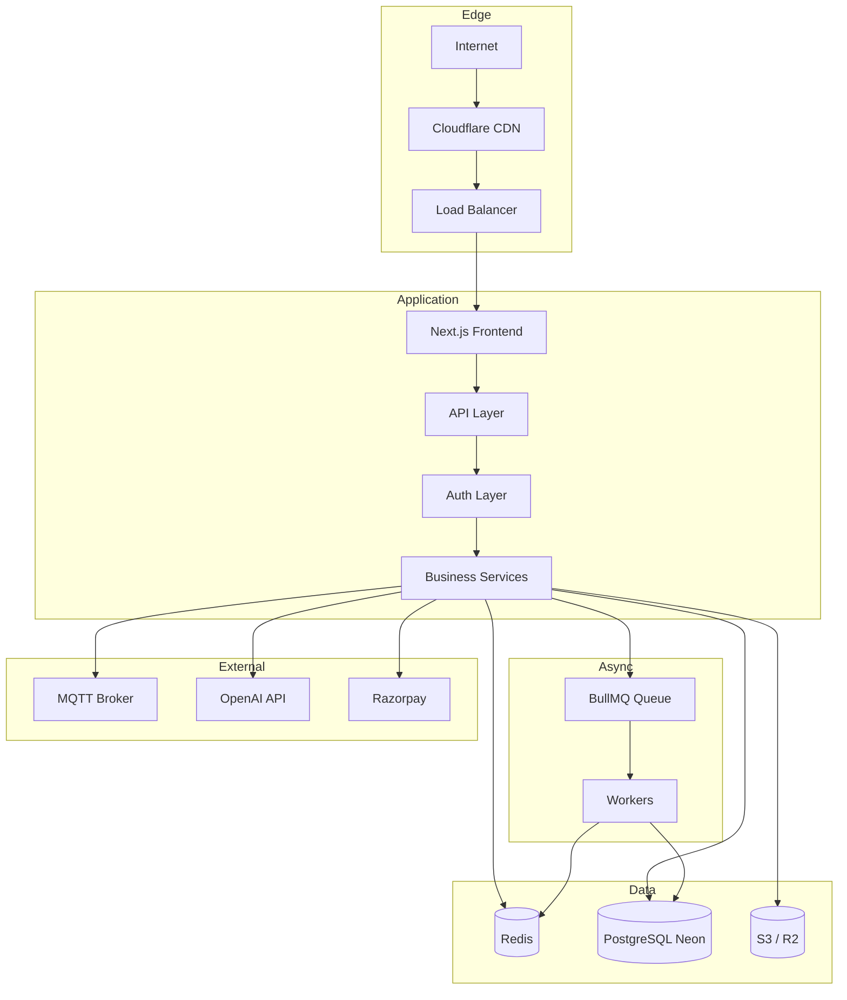

# System Overview

Production-grade, multi-tenant dairy ERP: e-commerce storefront, farm IoT/AI platform, mobile PWA, public API, and enterprise security — unified on a single Next.js codebase.

## High-Level Stack

```
                        Internet
                            │
                    Cloudflare CDN
                     (DNS, SSL, WAF,
                      R2, custom domains)
                            │
                     Load Balancer
                  (Nginx / K8s Ingress /
                   Vercel Edge Network)
                            │
                   Next.js 16 Frontend
              (App Router, React 19, Tailwind v4)
                            │
                       API Layer
        (/api/*  /api/v1/*  /api/public/v1/*)
                            │
                    Authentication
           (JWT cookies, RBAC/ABAC, API keys,
            WebAuthn, OAuth Google — Auth.js-ready)
                            │
                   Business Services
    (cart, orders, subscriptions, farm IoT, AI,
     tenant, security, mobile, developer API)
                            │
                      Queue (BullMQ)
                   workers/queue.worker.ts
                            │
                      Redis Cache
              (rate limits, sessions, BullMQ)
                            │
                 PostgreSQL (Neon)
                    Prisma ORM
                            │
              Object Storage (S3 / R2 / local)
                    lib/ops/storage.ts
                            │
                    IoT Layer (MQTT)
           edge gateway, mqtt-bridge worker
                            │
                    AI Layer (LLMs)
              OpenAI GPT, farm AI services
```

## Request Flow



## Layer Index

| Layer         | Document                         |
| ------------- | -------------------------------- |
| Frontend      | [frontend.md](./frontend.md)     |
| Backend & API | [backend.md](./backend.md)       |
| Database      | [database.md](./database.md)     |
| AI            | [ai.md](./ai.md)                 |
| IoT           | [iot.md](./iot.md)               |
| Security      | [security.md](./security.md)     |
| Deployment    | [deployment.md](./deployment.md) |
| Scaling       | [scaling.md](./scaling.md)       |

## Data Flows

### Milk order

```
Customer → Next.js → /api/payment/create-order → Razorpay
                  → Prisma Order → PostgreSQL
                  → Webhook → order.created → Developer webhooks
                  → DeliveryAssignment → /m/delivery
```

### IoT sensor

```
ESP32 → MQTT Broker → mqtt-bridge worker → /api/v1/iot/data
                                         → SensorReading (PostgreSQL)
                                         → Autonomy rules → Actuator commands
```

## Health Check

```bash
curl https://your-domain.com/api/health
```

Returns status for: `app`, `database`, `redis`, `queue`, `storage`, `mqtt`, `ai`, and a `layers` summary.

## Core Environment Variables

```env
DATABASE_URL=
REDIS_URL=
JWT_ACCESS_SECRET=
JWT_REFRESH_SECRET=
OPENAI_API_KEY=
RAZORPAY_KEY_SECRET=
MQTT_BROKER_URL=
STORAGE_PROVIDER=local|s3|r2
DEFAULT_TENANT_SLUG=default
```

See `.env.example` for the full list.
