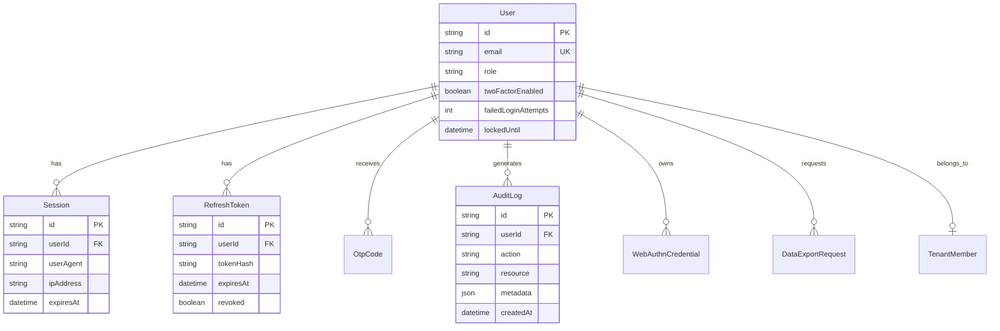

# ER Diagram — Core & Auth

## Key relationships

- **User** is the central identity for storefront, admin, farm, and mobile apps
- **Session** + **RefreshToken** implement device-aware session management
- **AuditLog** records security-sensitive actions (login, permission changes, GDPR)
- **TenantMember** links users to multi-tenant organizations (see [tenant.md](./tenant.md))

Schema: `prisma/schema.prisma`
