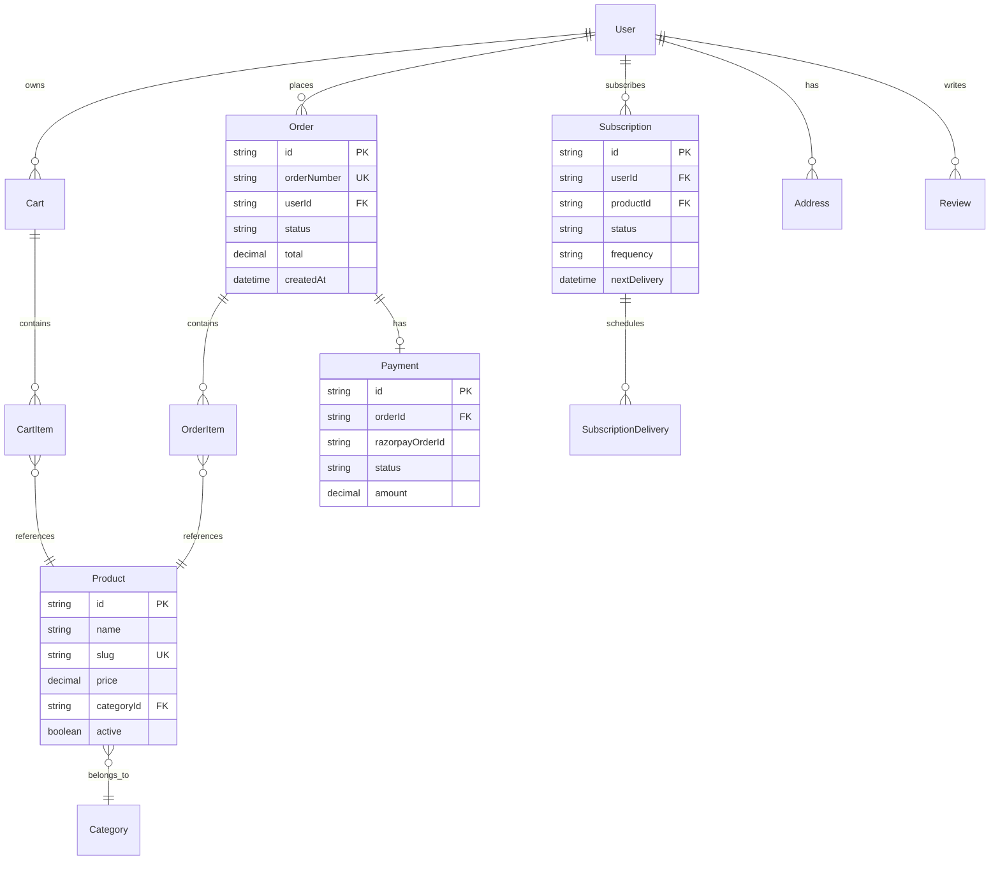

# ER Diagram — E-commerce



## Payment flow

```
Cart → Order → Payment (Razorpay) → Order.status = PAID
                                → SubscriptionDelivery scheduled
```

## Related

- [User guide: Ordering](../user-guides/ordering.md)
- [API: Internal](../api/internal-api.md)
