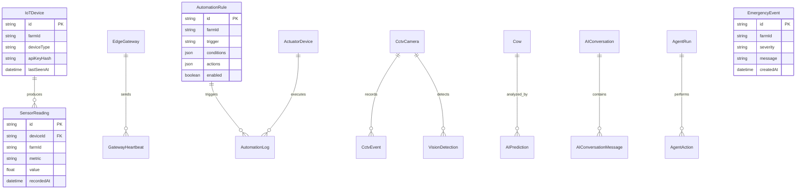

# ER Diagram — Farm & IoT



## Isolation

All farm models include `farmId` — scoped to `tenant.slug` for multi-tenant isolation.

## Data flow

```
IoTDevice → SensorReading → AutomationRule → ActuatorDevice
                         → AIPrediction / AIAlert
                         → EmergencyEvent
```

## Related

- [IoT architecture](../architecture/iot.md)
- [Farm guides](../farm-guides/setup.md)
